# Raspberry Pi HQ microscope more pics

Here are some more pictures where the RPI 3A+ is mounted without case.

|                             |                             |
| --------------------------- | --------------------------- |
| 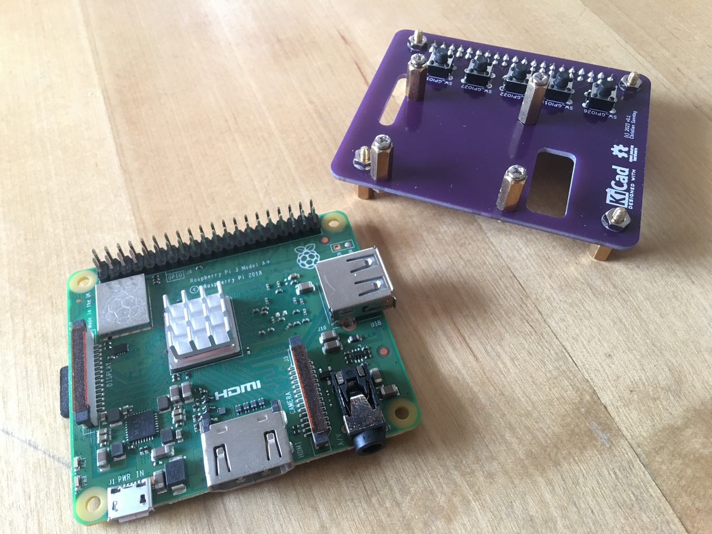 | 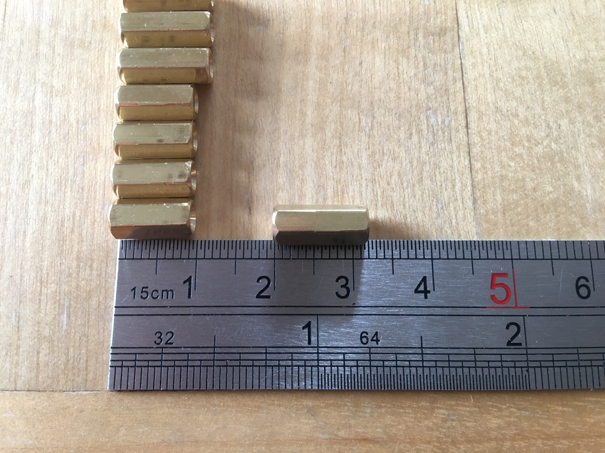 |
| 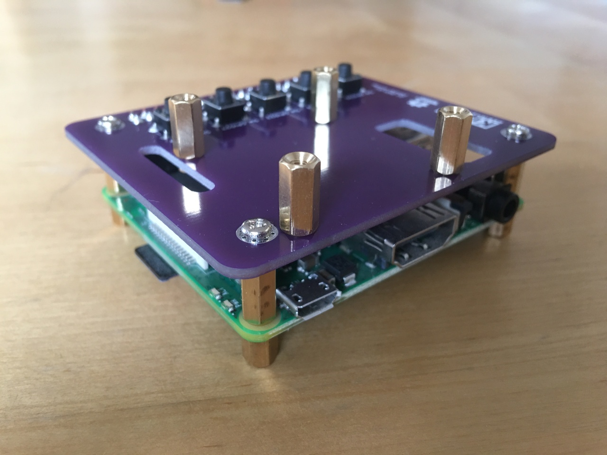 | 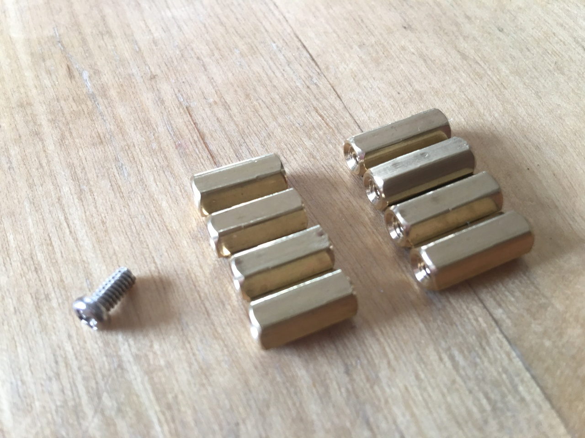 |
| 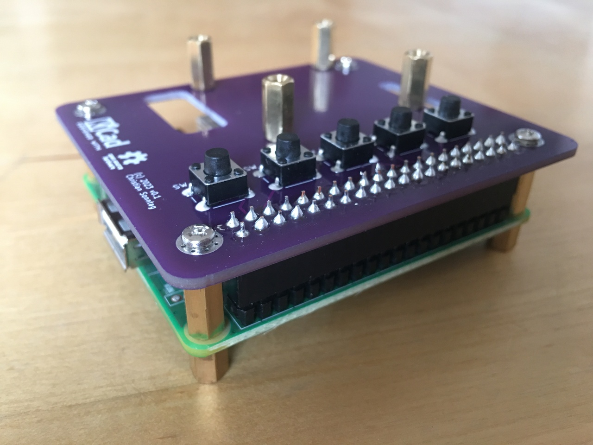 |  |
| 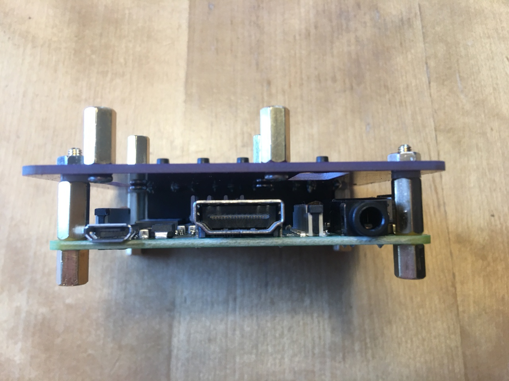 | 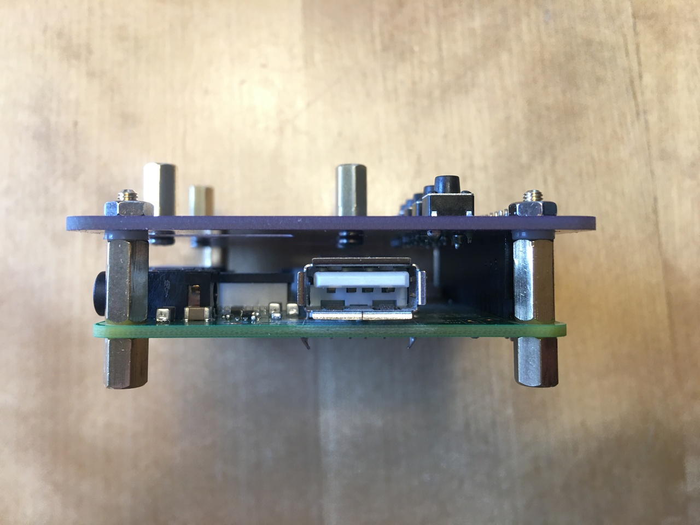 |
| 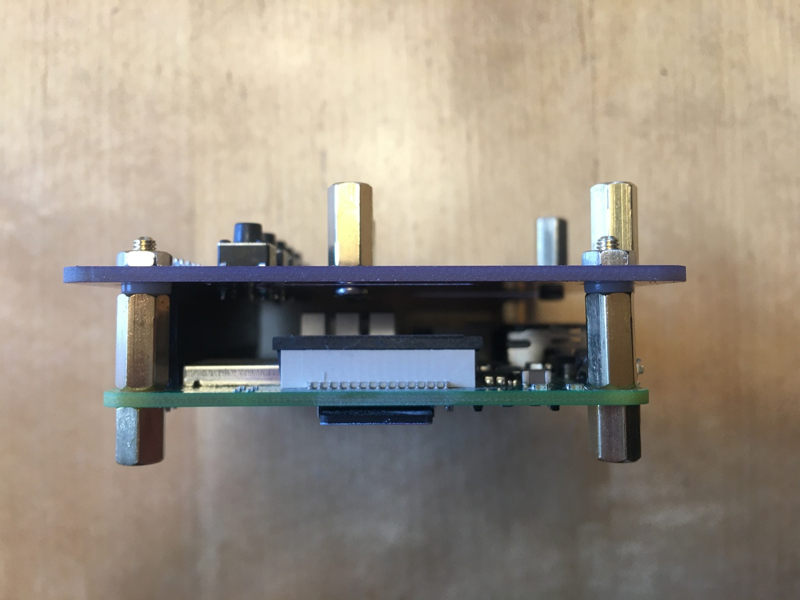 | 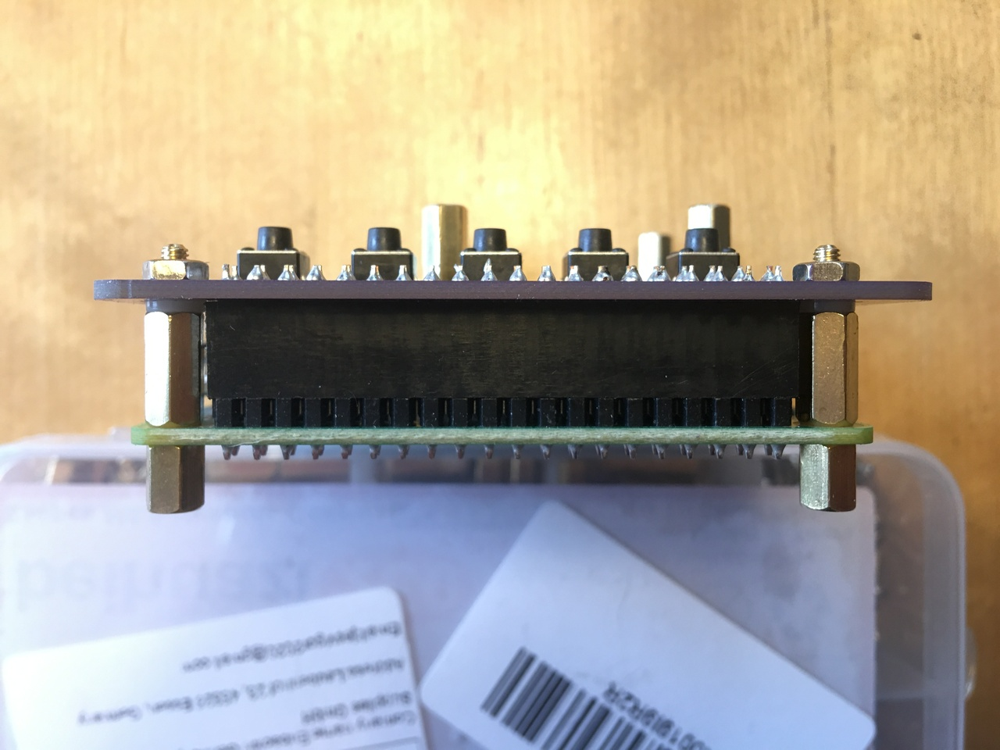 |
| 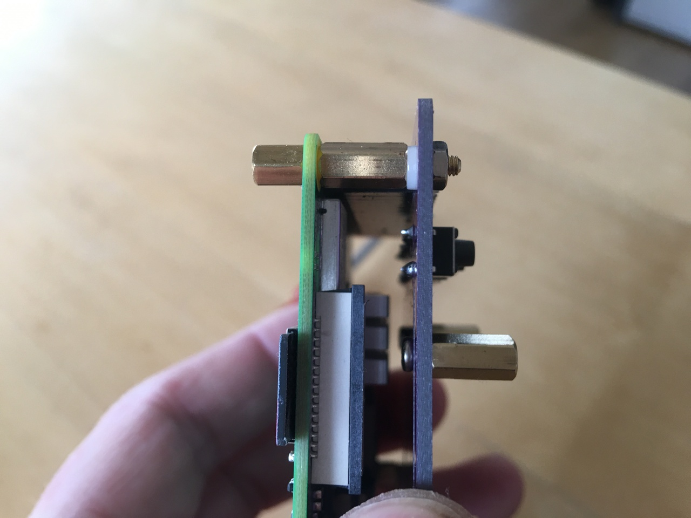 |                             |
| 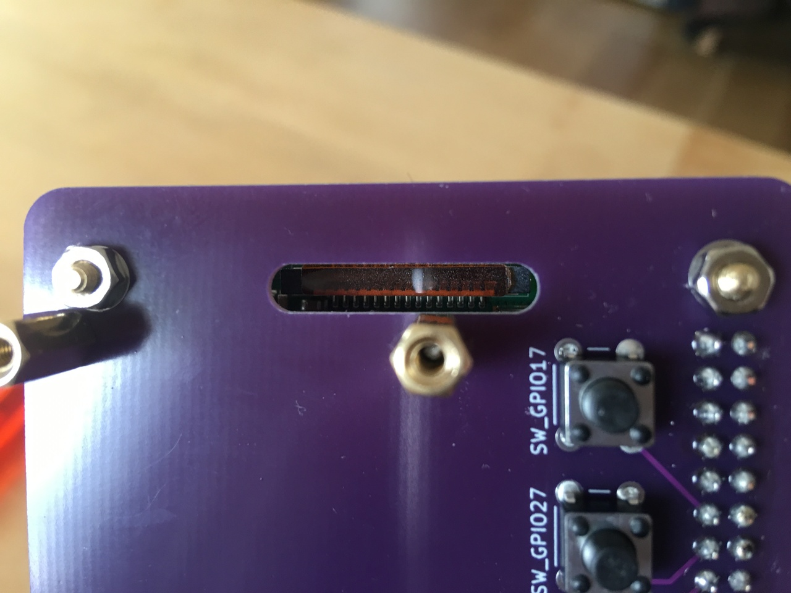 | 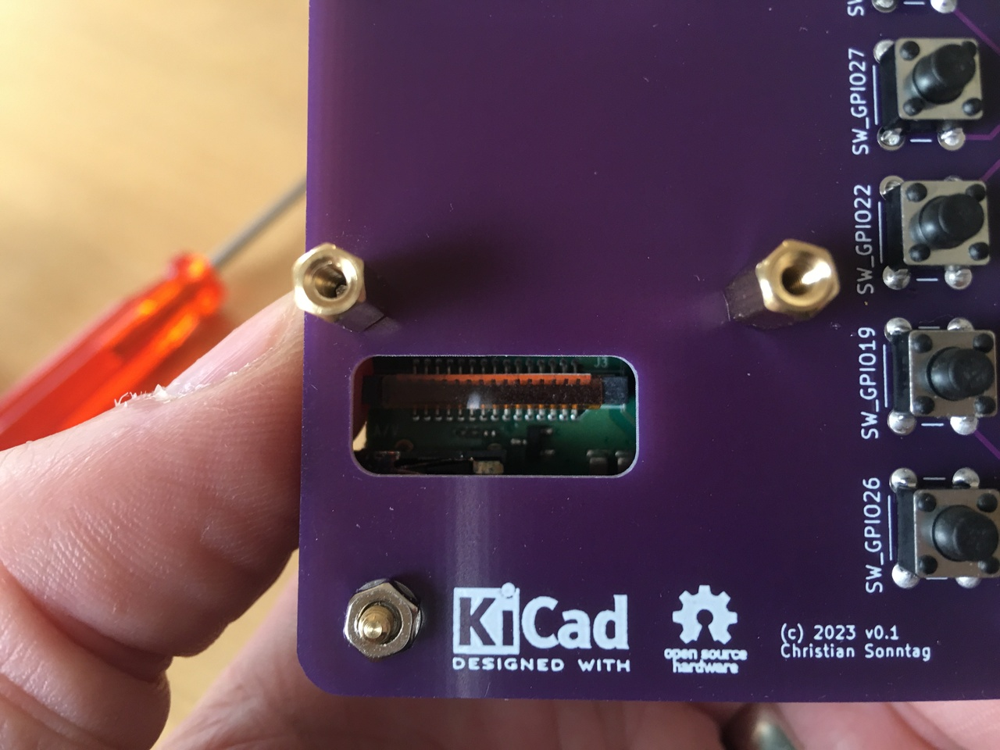 |

