# Raspberry Pi HQ microscope

> Current work in progress. Feel free to contribute 😉

## Table of Contents

- [Raspberry Pi HQ microscope](#raspberry-pi-hq-microscope)
  - [Table of Contents](#table-of-contents)
  - [Preface](#preface)
  - [PCB adapter or mount between RPI 3A+ and RPI HQ camera](#pcb-adapter-or-mount-between-rpi-3a-and-rpi-hq-camera)
    - [PCB images](#pcb-images)
    - [Available buttons](#available-buttons)
  - [BOM](#bom)
  - [Software](#software)
    - [SD Card](#sd-card)
    - [Install needed packages](#install-needed-packages)
    - [Cronjobs](#cronjobs)
      - [list running cronjobs](#list-running-cronjobs)
      - [stop running cronjonb process](#stop-running-cronjonb-process)
    - [Python](#python)
  - [Links to other projects or resources](#links-to-other-projects-or-resources)
  - [more pictures](#more-pictures)

## Preface

A small project to build a custom electro microscope based on a Raspberr Pi 3A+ and Raspberry HQ camera. 
But why a 3A+? Because of current delivery problems. The 3A+ has also a normal HDMI port and not such an
fiddly diddly micro hdmi port 😜 Also the form factor and the geekworm case is a good choice.
In fact that it based on a Raspberry Pi it can be modified in any direction.

|                        |                        |
| ---------------------- | ---------------------- |
| 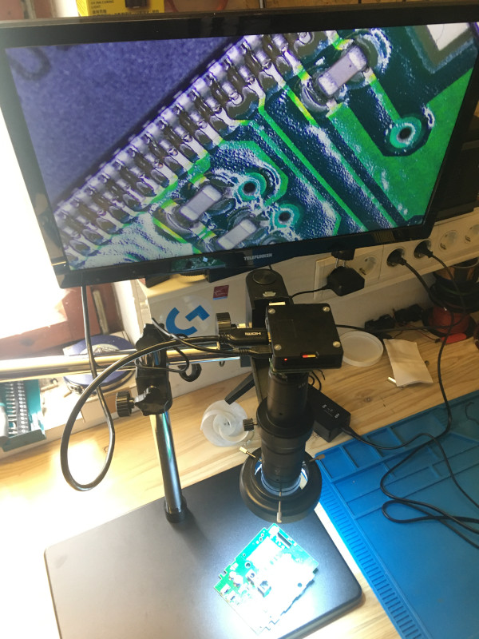 | 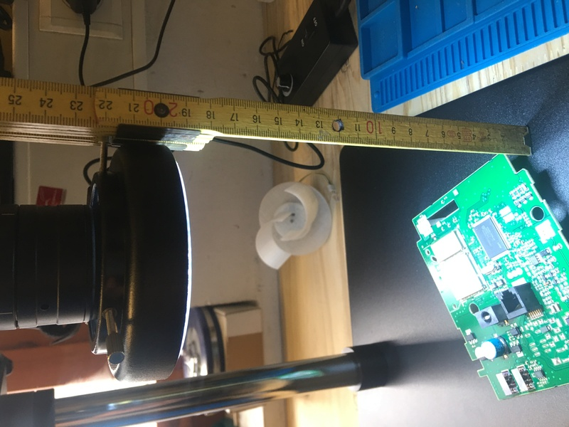 |
| 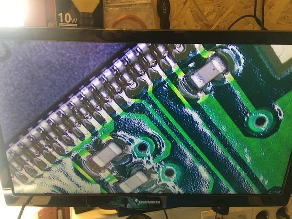 | 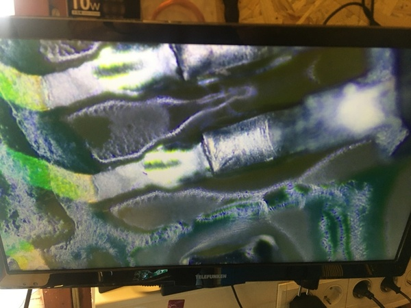 |


## PCB adapter or mount between RPI 3A+ and RPI HQ camera

The [pcb](pcb/README.md) acts as mounting adapter between the Raspberry Pi 3A+ and the Raspberry Pi HQ Camera. 
It has also 5 buttons that can be used to add custom functions with python.

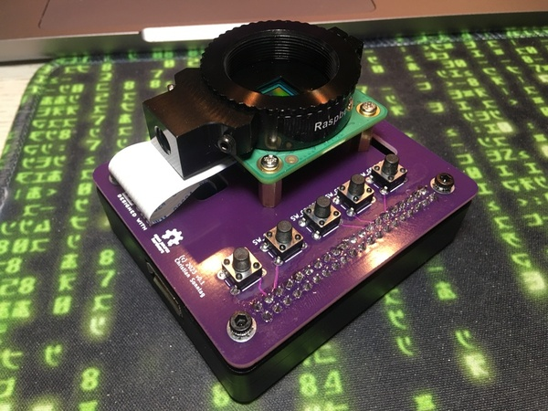


### PCB images

| Front                             | Back                             |
| --------------------------------- | -------------------------------- |
| 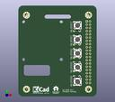 | 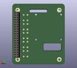 |

### Available buttons

| Button | GPIO | Function              |
| ------ | ---- | --------------------- |
| 1      | 17   | select mode/option    |
| 2      | 27   | increase option value |
| 3      | 22   | decrease option value |
| 4      | 19   | capture photo         |
| 5      | 26   | shutdown raspi        |


## BOM

| Part                                                | Quantity     | Description                                                    |
| --------------------------------------------------- | :----------- | -------------------------------------------------------------- |
| 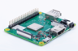                 | 1            | Raspberry Pi 3A+                                               |
|    | 1            | [Geekworm Raspberry pi case](http://wiki.geekworm.com/P88)     |
| 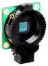               | 1            | Raspberry Pi HQ camera                                         |
| 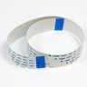            | 1            | camera cable 6 cm                                              |
| 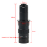 | 1            | 180x zoom objective with c-mount                               |
| 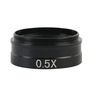            | 1            | 0.5x barlow lens                                               |
| 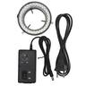              | 1            | LED ring light                                                 |
| 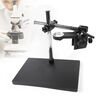            | 1            | Heavy duty stand                                               |
| 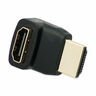             | 1 (optional) | HDMI 90° adapter                                               |
| 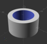                        | 1 (optional) | [spacer](spacer/README.md) for the heavy duty stand            |
| 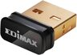             | 1 (optional) | USB Wifi dongle **(optional for "better" wifi connectivity)**  |
|                    | 1 (optional) | [pcb](pcb/README.md) **(optional. depending to your needs.)**                       |
| 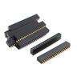    | 1 (optional) | header femal 2x20 pin **(optional. depending to your needs.)** |
| 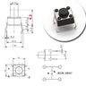                 | 5 (optional) | push button 6x6 **(optional. depending to your needs.)**       |

## Software

### SD Card

Prepare Sd-Card with Raspberry Pi OS Lite 32 bit image as usual described in a lot of places in web with [balenaEtcher](https://www.balena.io/etcher?ref=etcher_footer) or similar tool. 
64 bit version of Raspberry Pi OS is not working because needed ```libmmal``` is not available for aarch64.

### Install needed packages

```bash
sudo apt install python3-pip
sudo apt install python3-picamera

pip install picamera
```

### Cronjobs

Starting needed software with crontab on boot. Can vary depending to custom needs. Use ```crontab -e``` to edit the cron jobs.

```
# start simple preview to hdmi output
#@reboot libcamera-still -t 0 --width 1920 --height 1080 --rotation 180 -o current.jpg

# start python script. path to user home can vary in your case
#@reboot sudo python /home/micro/shutdown.py
@reboot sudo python /home/micro/advanced.pyq
```

#### list running cronjobs

```bash
pstree -apl `pidof cron`

or 

ps aux |grep "/home/micro/advanced.py"

or

ps -o pid,sess,cmd afx | egrep -A20 "( |/)cron( -f)?$"
```

#### stop running cronjonb process

```bash
# stopping process
pkill -s [pid]

#example
pkill -s 424
```

### Python

Scripts for use with cronjob. Place it in the home folder.

* [Simple shutdown only script](src/shutdown.py)
* [Advanced script](src/advanced.py)


## Links to other projects or resources

* [Thingiverse: Pi Mocroscope](https://www.thingiverse.com/thing:3920261)
* [hackaday.io: Pi Microscope](https://hackaday.io/project/167996-pi-microscope)
* [Github: amphioxus/raspi_camera_scripts](https://github.com/raspberrypi/picamera2)
* [Github: raspberrypi/picamera2](https://github.com/amphioxus/raspi_camera_scripts)
* [element14 community: I Spy With My Digital Eye .... a Pico PI](https://community.element14.com/challenges-projects/project14/offtheshelf/b/blog/posts/i-spy-with-my-digital-eye-a-pico-pi)
* [Picamera readthedocs](https://picamera.readthedocs.io/en/latest/)
* [Picamera library pdf](https://datasheets.raspberrypi.com/camera/picamera2-manual.pdf)
* [Geekworm Raspberry pi case](http://wiki.geekworm.com/P88)

## more pictures

[More pictures](README-more-pics.md)
